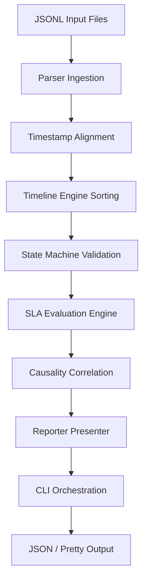

# Incident Timeline Reconstructor (`incident-timeline-reconstructor`)

An offline operational reliability tool that parses, normalizes, aligns, and reconstructs chronological timelines of production incidents using system alerts, application logs, deployment events, and manual engineer actions.

---

## 1. Project Overview & Features
This repository processes raw, unstructured application telemetry logs to generate audit-ready incident postmortem reports. It features:
- **Timestamp Alignment & Skew Correction**: Normalizes Unix Epoch and ISO8601 timestamps to UTC and corrects clock skew offsets based on service topology definitions.
- **Deterministic Multi-Key Sorter**: Resolves sorting order for simultaneous events.
- **Independent State Machine Verification**: Enforces incident status validations.
- **SLA Metrics Engine**: Computes Time-to-Detect (TTD), Time-to-Acknowledge (TTA), and Time-to-Mitigate (TTM) parameters.
- **Causality Correlation**: Resolves primary root causes using temporal proximity lookup indices.

---

## 2. High-Level Architecture

The processing pipeline is designed as a unidirectional, layered system:



---

## 3. Installation & Local Execution

### Requirements
- Python >= 3.8
- No external package dependencies (uses only standard library).

### Installation
Clone the repository and install in editable mode:
```bash
cd repos/rfc2
python3 -m pip install -e .
```

### CLI Execution Example
```bash
python3 -m src.cli --config config/ --input fixtures/alerts.jsonl fixtures/actions.jsonl --pretty
```

---

## 4. Input Configurations

### `config/topology.json`
```json
{
  "services": [
    {"name": "gateway", "dependencies": ["auth"], "clock_skew_seconds": 0},
    {"name": "auth", "dependencies": [], "clock_skew_seconds": -5}
  ]
}
```

### `config/rules.json`
```json
{
  "sla": {
    "max_acknowledgement_seconds": 900,
    "max_mitigation_seconds": 3600
  },
  "correlation": {
    "causality_window_seconds": 600,
    "debounce_window_seconds": 60
  }
}
```

---

## 5. Output Specification

The CLI outputs a structured JSON report details similar to the following format:
```json
{
  "summary": {
    "total_events": 5,
    "total_incidents": 1,
    "has_any_violations": false
  },
  "incidents": {
    "auth:AuthFailures": {
      "incident_identifier": "auth:AuthFailures",
      "service": "auth",
      "alert_name": "AuthFailures",
      "final_state": "Resolved",
      "has_state_violations": false,
      "sla": {
        "time_to_detect_seconds": 0,
        "time_to_acknowledge_seconds": 300,
        "time_to_mitigate_seconds": 900,
        "ack_compliant": true,
        "mitigate_compliant": true
      },
      "causality": {
        "primary_cause": "UNKNOWN",
        "confidence": "LOW",
        "reason": "No clear deployment trigger or mitigation action identified within correlation windows.",
        "supporting_events": []
      }
    }
  }
}
```

---

## 6. Testing
Run tests using Python's `unittest` module:
```bash
PYTHONPATH=repos/rfc2 python3 -m unittest repos/rfc2/tests/test_suite.py
```

---

## 7. License
This project is licensed under the MIT License.
