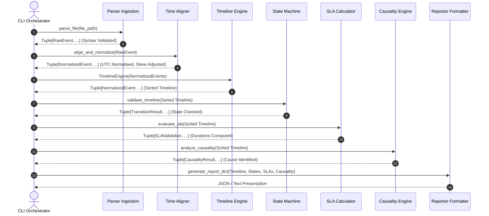

# System Architecture: Incident Timeline Reconstructor

This document specifies the technical architecture, design principles, invariants, and Project Mina benchmark design considerations of the Incident Timeline Reconstructor (`incident-timeline-reconstructor`) repository.

---

## 1. Project Overview & Architectural Goals

The Incident Timeline Reconstructor parses and normalizes disparate operational telemetry files to reconstruct a unified, chronological timeline of production outages, validate SLA compliance, and correlate root causes.

### Primary Design Goals
- **Deterministic Execution**: Given identical inputs, execution results must be identical.
- **Predictable Debugging**: Errors fail fast at structural boundaries (parsing/config) or log audit exceptions without crashing runtime operations.
- **Layer Isolation**: Layer boundaries are enforced; lower layers are unaware of business metrics.
- **Offline Operations**: Standard-library only. No active network, databases, or container dependencies.
- **Immutability**: Domain models are frozen during instantiation to prevent state pollution.

---

## 2. Non-Goals
The system intentionally does **NOT** support:
- Real-time event streaming or message queue ingestions.
- Distributed execution clusters or horizontal scaling mechanisms.
- Machine learning or probabilistic root-cause inference.
- Hot-path database storage or transactional log writes.
- Graphical User Interfaces (GUIs) or web dashboards.

---

## 3. Layer Responsibilities

| Layer | Responsibilities | Must NOT Do | Dependencies |
| :--- | :--- | :--- | :--- |
| **CLI (`cli.py`)** | Orchestrates components; handles arguments. | Implement business rules. | All layers |
| **Reporter (`reporter.py`)** | Formats output payloads statelessly. | Re-sort timelines, compute SLAs. | `src.models`, engines |
| **Causality (`causality.py`)** | Correlates triggers and mitigations. | Mutate events, validate states. | `src.models`, `src.config` |
| **SLA (`sla.py`)** | Calculates compliance durations. | Resolve causality, mutate events. | `src.models`, `src.config` |
| **State (`state.py`)** | Validates sequential transition paths. | Compute SLAs, parse datetimes. | `src.models`, `src.constants` |
| **Engine (`engine.py`)** | Sorts normalized events. | Check SLAs, evaluate transitions. | `src.models`, `src.constants` |
| **Parser (`parser/`)** | Ingests data; corrects clock offsets. | Sort timelines, track state checks. | `src.models`, `src.exceptions` |
| **Models (`models.py`)** | Defines domain types & leaf invariants. | Ingest files, evaluate rules. | `src.constants` |

---

## 4. Data Flow Sequence

The diagram below maps object handoffs and execution sequences between layers:



---

## 5. Object Lifecycle

An event transitions through the following structural states:

```
[Raw JSON string]
       │
       ▼ (Parser Validation)
[RawEvent]
       │
       ▼ (UTC Alignment & Skew Adjustment)
[NormalizedEvent]
       │
       ▼ (Timeline Sorting & Key Grouping)
[Timeline Sorted Event]
       │
       ├─────────────────────────┼─────────────────────────┐
       ▼                         ▼                         ▼
[TransitionResult]        [SLAValidation]           [CausalityResult]
       │                         │                         │
       └─────────────────────────┼─────────────────────────┘
                                 ▼
                     [Presentation Model (JSON/Text)]
```

---

## 6. Design Trade-offs

- **Offline Processing vs. Real-time Ingestion**: By choosing offline processing, we prioritize complete reproducibility, zero database dependencies, and execution speed over real-time processing capability.
- **Multi-key Deterministic Sorting vs. Natural Ingestion Sorters**: Using an explicit 4-key tuple key ensures identical timestamps do not result in unstable sorting behaviors across different Python execution environments.
- **Table-Driven State Validation vs. Nested If-Else Rules**: Using transition matrices (`LEGAL_TRANSITIONS`) simplifies path validation and prevents logic bugs when checking state flows.

---

## 7. System Invariants

- **Uniqueness**: Event IDs must be globally unique across all input files.
- **Stable Sorting**: Timeline ordering is fully stable and deterministic.
- **Zero Business Logic Leaks**: CLI and Reporter modules contain no business logic or math operations.
- **Context Isolation**: Calculations are evaluated per `IncidentKey`, preventing concurrent events from interfering with each other's status indicators.
- **Layer Integrity**: Lower layers never import or depend on upper layers.

---

## 8. Failure Modes

| Failure Scenario | Detection Layer | Recovery/Behavior | Fatal? |
| :--- | :--- | :--- | :---: |
| **Malformed JSONL** | `JsonlParser` | Logs syntax error details to stderr. | **Yes** |
| **Duplicate Event ID** | `JsonlParser` | Flags ID collision and raises `ValidationError`. | **Yes** |
| **Cyclic Dependency** | `TopologyConfig` | Identifies cycle and raises `TopologyError`. | **Yes** |
| **Orphan Dependency** | `TopologyConfig` | Identifies missing targets and raises `TopologyError`.| **Yes** |
| **Illegal State Transition** | `IncidentStateMachine` | Logs `TransitionResult` status as invalid; continues processing. | **No** |
| **Missing SLA metric** | `SLACalculator` | Sets parameter value to `None`; continues processing. | **No** |

---

## 9. Complexity Summary

| Module / Operation | Time Complexity | Memory Complexity | Dominant Operation |
| :--- | :---: | :---: | :--- |
| **Parser Ingestion** | $O(N)$ | $O(N)$ | IO streaming and set-based uniqueness lookup. |
| **Timeline Sorting** | $O(N \log N)$ | $O(N)$ | Timsort utilizing a 4-key comparison key. |
| **State Verification** | $O(N)$ | $O(N)$ | Single-pass validation over the sorted timeline. |
| **SLA Calculation** | $O(N)$ | $O(N)$ | Single-pass classification and classification lookup. |
| **Causality Indexing** | $O(N)$ | $O(N)$ | Single-pass indexing via `IncidentEventIndex`. |
| **Report Generation** | $O(N)$ | $O(N)$ | Ingesting tables and formatting outputs. |

---

## 10. Architectural Decision Records (ADRs)

### ADR-001: Use Immutable Dataclasses
- **Status**: Accepted
- **Reason**: Eliminates side-channel state modifications during timeline analysis passes.
- **Consequences**: Values must be constructed and passed down the pipeline, preventing in-place modifications.

### ADR-002: Timeline Engine Isolation
- **Status**: Accepted
- **Reason**: Separating timeline sorting from state checking ensures downstream engines process events sequentially, reducing validation logic complexity.
- **Consequences**: The timeline must be sorted before state machines or SLA calculators run.

### ADR-003: Table-driven State Machine
- **Status**: Accepted
- **Reason**: Simplifies state path validation and prevents logic bugs when checking state transitions.
- **Consequences**: Changes to the transition lifecycle require updates to configuration tables rather than code refactoring.

### ADR-004: Indexed Causality Engine
- **Status**: Accepted
- **Reason**: Resolves causality triggers and mitigations using a single indexed view (`IncidentEventIndex`), preventing multiple timeline scans.
- **Consequences**: Creates a minor memory overhead, but improves runtimes.

---

## 11. Project Mina Benchmark Notes

This codebase serves as a high-quality Project Mina benchmark target:
- **Layered Debugging**: Bugs injected into low-level modules (e.g. `time_aligner.py` timestamp parsing) propagate up, causing subtle output validation failures in the causality report.
- **Cross-module Reasoning**: Fixing a bug like the **Causality Attribution Leak** requires tracking events from raw parser formats, verifying UTC timestamps, evaluating state transitions, and checking whether the action event precedes healthy telemetry.
- **Logical Troubleshooting**: System bugs trigger logic faults rather than code crashes, testing an agent's reasoning rather than simple syntax fixing.
